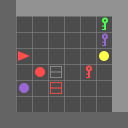
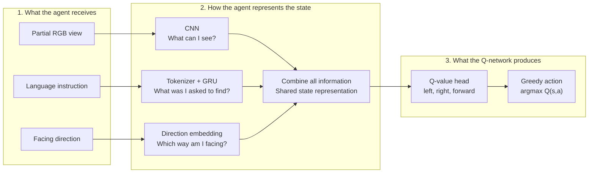

# Simplified Vision-Language Navigation with Deep Q-Learning

This project is a proof of concept for Vision-Language Navigation (VLN) in
`BabyAI-GoToLocal-v0`. The agent receives a partial RGB view of its surroundings,
a natural-language instruction such as `go to the red ball`, and its current
direction. It learns action values with Deep Q-Learning and must navigate to the
requested object using only three actions:

<p align="center">
  
</p>

<p align="center"><em>Example BabyAI-GoToLocal-v0 episode. This full-grid view helps readers follow the navigation task.</em></p>

| ID | Action | Meaning |
|---:|---|---|
| 0 | `left` | Rotate left |
| 1 | `right` | Rotate right |
| 2 | `forward` | Move one cell forward |

Restricting the agent to navigation actions removes irrelevant MiniGrid actions
such as pickup, drop, toggle, and done. Partial observability still makes the
task challenging: the target or an obstacle may be outside the current field of
view, so the agent must choose an action from incomplete visual information.

## Why Deep Q-Learning

Tabular Q-learning stores one value for every state-action pair. That is not
practical here because a state contains an RGB image, a language instruction,
and a direction. Exact observations rarely repeat, and a table cannot naturally
generalize between visually or linguistically similar situations.

Deep Q-Learning, commonly called DQN, keeps the Q-learning objective but replaces
the table with a neural network:

$$
Q_\theta(\text{image},\text{mission},\text{direction},a).
$$

The network can learn reusable visual and language features while still using
the Bellman target, temporal-difference error, and epsilon-greedy exploration
from elementary Q-learning.

## Q-network

The model works in three stages. Read the diagram from left to right:



| Information | Encoder | Encoded size |
|---|---|---:|
| Partial RGB image | CNN | 128 |
| Mission text | Word embedding + GRU | 128 |
| Agent direction | Learned embedding | 16 |
| Combined information | Linear layer + ReLU | 256 |

The final layer produces one unrestricted real-valued estimate per action:

```text
Q(s, left), Q(s, right), Q(s, forward)
```

These values are expected discounted returns, not probabilities. They do not
use softmax, do not need to sum to one, and may be negative. During greedy action
selection, the agent chooses

$$
a_t=\arg\max_a Q_{\mathrm{online}}(s_t,a).
$$

## Deep Q-Learning algorithm

Training alternates between environment interaction and replay-buffer updates:

1. Select an action with an epsilon-greedy policy.
2. Execute the action and store `(state, action, reward, next state, terminated, truncated)` in replay memory.
3. During replay warm-up, collect transitions without changing the network.
4. Randomly sample a minibatch from replay memory.
5. Use the online network to predict the Q-value of each action that was taken.
6. Use the frozen target network to calculate stable next-state values.
7. Calculate the temporal-difference target and Huber loss.
8. Update only the online network by gradient descent.
9. Periodically copy the online-network parameters into the target network.
10. Evaluate fixed validation seeds and save the best checkpoint.

The replay buffer breaks correlations between consecutive observations and
allows transitions to be reused. Therefore, the number of training sample
presentations can be much larger than the number of unique environment
transitions.

### Online and target networks

The two Q-networks have identical architectures but different roles:

| Network | Purpose | Receives gradients? |
|---|---|---:|
| Online network | Select actions and predict current-state Q-values | Yes |
| Target network | Calculate stable next-state targets | No |

The target network is initialized from the online network and remains fixed
between synchronization events:

```text
target network <- online network
```

This prevents the prediction and its learning target from changing together
after every optimizer step.

### Epsilon-greedy exploration

During training, an action is selected according to

```text
with probability epsilon: choose a random action
otherwise:                choose argmax Q_online(state, action)
```

Epsilon decreases linearly from `1.0` to `0.05`. Early behavior is mostly
exploratory, while later behavior relies primarily on learned Q-values.
Evaluation does not use epsilon; it always uses the greedy policy.

### Reporting epochs

The trainer prints **reporting epochs** to make the learning process visible.
A reporting epoch is a monitoring window, not a complete pass through a fixed
dataset. DQN has no conventional dataset epoch because it continuously collects
new transitions and randomly samples replay memory.

Each report shows:

- environment transitions collected;
- random and online-network actions;
- replay-buffer occupancy;
- optimizer updates;
- replay samples presented to the network;
- online and target network evaluations;
- target-network synchronizations;
- Q-values, TD targets, Huber loss, and gradient norms;
- training and validation success measurements.

## Q-learning target and loss

For a sampled transition, the online-network prediction is

$$
Q_{\mathrm{online}}(s_t,a_t).
$$

The vanilla-DQN target is

$$
y_t = r_t + \gamma(1-d_t)
\max_a Q_{\mathrm{target}}(s_{t+1},a),
$$

where $d_t$ is one for a true terminal state and zero otherwise. A pure time
limit truncation still bootstraps from the valid final observation, so the mask
uses `terminated` rather than `terminated or truncated`.

The temporal-difference error is

$$
\delta_t=y_t-Q_{\mathrm{online}}(s_t,a_t).
$$

The online network minimizes the Huber loss

$$
L_{\mathrm{DQN}}=
\operatorname{Huber}
\left(Q_{\mathrm{online}}(s_t,a_t),y_t\right).
$$

Huber loss behaves like squared error near zero but is less sensitive to large
initial TD errors. Gradients are clipped before each optimizer step.

### Optional Double DQN

Vanilla DQN uses the target network both to select and evaluate the next action.
Double DQN reduces optimistic value estimates by separating those operations:

$$
a^*=\arg\max_a Q_{\mathrm{online}}(s_{t+1},a),
$$

$$
y_t=r_t+\gamma(1-d_t)
Q_{\mathrm{target}}(s_{t+1},a^*).
$$

Enable this behavior with `--double-dqn`. Vanilla DQN remains the default so it
can serve as the elementary baseline.

## Default training schedule

| Quantity | Value |
|---|---:|
| Total environment transitions | 100,000 |
| Replay-buffer capacity | 20,000 |
| Replay warm-up | 5,000 transitions |
| Minibatch size | 64 |
| Training frequency | Every 4 environment steps |
| Target synchronization | Every 1,000 environment steps |
| Discount factor $\gamma$ | 0.99 |
| Adam learning rate | $1\times10^{-4}$ |
| Initial epsilon | 1.0 |
| Final epsilon | 0.05 |
| Epsilon decay duration | 50,000 steps |
| Maximum gradient norm | 10.0 |
| Validation interval | 5,000 steps |
| Fixed validation episodes | 50 |

With an update every four environment steps, a 100,000-step run performs at
most approximately 23,750 optimizer updates after the 5,000-step warm-up. At 64
samples per update, that is approximately 1.52 million replay-sample
presentations. These are not 1.52 million unique transitions; replay memory
intentionally reuses collected experience.

## Training outputs and results

The trainer writes its outputs under `runs/dqn_gotolocal` by default:

| Output | Purpose |
|---|---|
| `training_metrics.csv` | Reporting-epoch training and validation measurements |
| `checkpoint_last.pt` | Most recently validated training state |
| `checkpoint_best.pt` | Checkpoint with the best fixed-seed validation score |

The best checkpoint is selected primarily by validation success rate. Higher
mean return and shorter mean episode length are used as tie-breakers.

No completed DQN experiment is currently included in the default run directory,
so this README does not claim DQN performance numbers. This avoids presenting
the repository's earlier PPO measurements as DQN results. After training and
evaluation, the generated CSV and JSON files are the source of truth.

Useful measurements include:

| Measurement | Interpretation |
|---|---|
| Mean episode return | Average reward from recently completed episodes |
| Success rate | Fraction of episodes that reached the requested object |
| Mean TD loss | Difference between online predictions and Bellman targets |
| Mean selected Q-value | Predicted return for actions stored in replay |
| Mean target value | Bellman target used for learning |
| Mean absolute TD error | Average magnitude of the learning error |
| Validation success rate | Greedy performance on fixed validation seeds |

A falling TD loss alone does not prove that navigation improved. Validation
success rate and return are the principal task-performance measurements.

## Evaluation

`evaluate_dqn.py` loads `checkpoint_best.pt` and evaluates a greedy policy:

$$
a_t=\arg\max_a Q_{\mathrm{online}}(s_t,a).
$$

Use evaluation seeds `1000` through `1099` for a 100-episode test set that is
separate from the default validation seeds. The evaluator records each mission,
return, episode length, success flag, mean selected Q-value, and action counts.

The evaluation JSON contains two top-level sections:

```text
summary
episodes
```

This makes episode returns and success flags available to plotting and
comparison tools without parsing terminal output.

## Best result cases

The evaluator can retain the highest-return episodes and save them as MP4
videos. Each frame displays:

- the mission;
- the selected action;
- all predicted Q-values;
- immediate reward and cumulative return;
- episode status.

The videos show the full grid for human interpretation. The Q-network itself
still receives only the partial RGB observation, mission text, and direction.

## Installation and usage

Install the dependencies:

```powershell
python -m pip install -r requirements.txt
```

Check the environment, model, replay buffer, and update calculation:

```powershell
python -m scripts.test_env
python -m scripts.test_q_model
python -m scripts.test_replay_buffer
python -m scripts.test_dqn_update
```

Run a short end-to-end debug experiment:

```powershell
python -m training.train_dqn `
  --debug `
  --output-dir runs/dqn_debug
```

Train vanilla DQN:

```powershell
python -m training.train_dqn `
  --total-steps 100000 `
  --learning-rate 0.0001 `
  --batch-size 64 `
  --replay-capacity 20000 `
  --learning-starts 5000 `
  --train-frequency 4 `
  --target-update-frequency 1000 `
  --epsilon-decay-steps 50000 `
  --validation-episodes 50 `
  --validation-interval 5000 `
  --output-dir runs/dqn_gotolocal
```

Train Double DQN in a separate output directory:

```powershell
python -m training.train_dqn `
  --total-steps 100000 `
  --double-dqn `
  --output-dir runs/double_dqn_gotolocal
```

Evaluate the best vanilla-DQN checkpoint:

```powershell
python evaluate_dqn.py `
  --checkpoint runs/dqn_gotolocal/checkpoint_best.pt `
  --episodes 100 `
  --seed 1000 `
  --output runs/dqn_gotolocal/evaluation_results.json
```

Evaluate and save the three highest-return videos:

```powershell
python evaluate_dqn.py `
  --checkpoint runs/dqn_gotolocal/checkpoint_best.pt `
  --episodes 100 `
  --seed 1000 `
  --output runs/dqn_gotolocal/evaluation_results.json `
  --video-dir runs/dqn_gotolocal/videos `
  --video-episodes 3
```

Print every evaluation action and its Q-values with `--show-steps`. Use this for
short diagnostic evaluations because it produces substantial terminal output:

```powershell
python evaluate_dqn.py `
  --checkpoint runs/dqn_debug/checkpoint_best.pt `
  --episodes 3 `
  --show-steps
```

## Project structure

```text
models/q_network.py              vision-language Q-network
algorithms/replay_buffer.py      fixed-capacity experience replay
algorithms/dqn.py                Bellman target and optimizer update
training/train_dqn.py            collection, training, validation, reporting
evaluate_dqn.py                  greedy evaluation and optional videos
scripts/test_q_model.py          Q-network shape and gradient checks
scripts/test_replay_buffer.py    replay storage and sampling checks
scripts/test_dqn_update.py       online update and target-network checks
```

## Current limitation

The environment is partially observable, but the current Q-network receives
only the current observation. It does not remember earlier views. A future
recurrent DQN or observation-history model could address this limitation. The
present implementation is intentionally small so the core Deep Q-Learning
process remains visible and easy to inspect.
