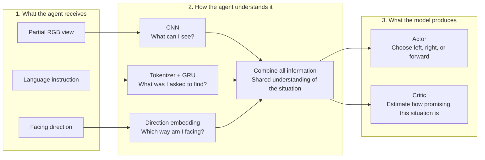
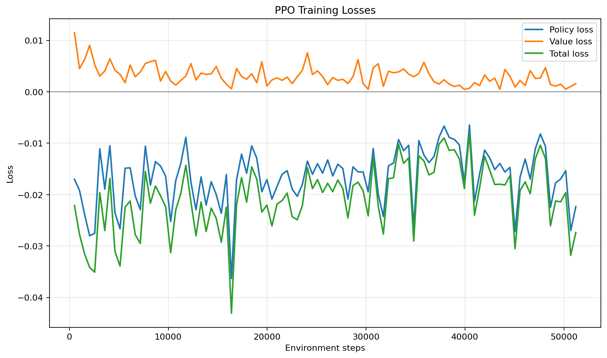
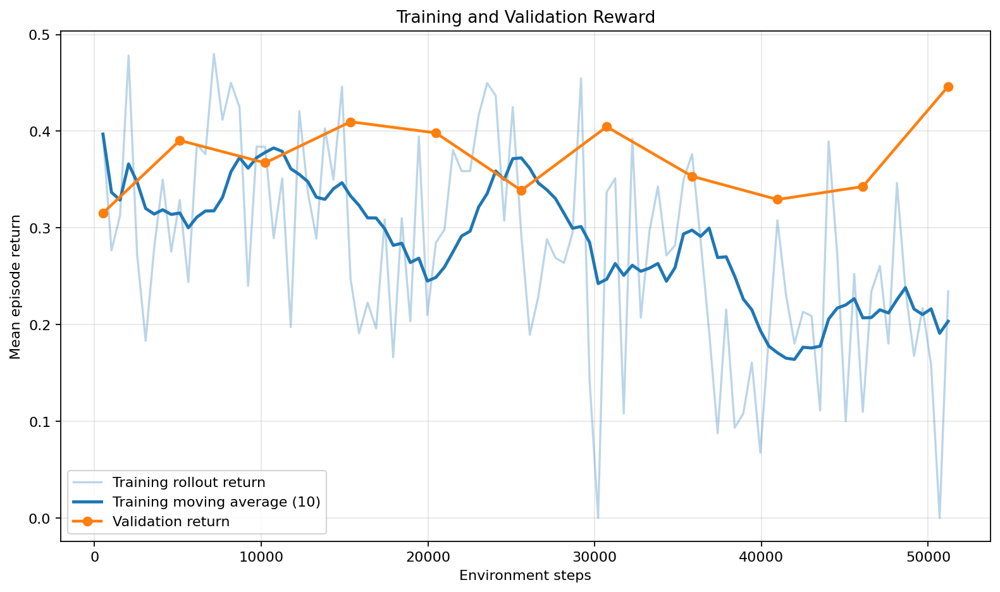
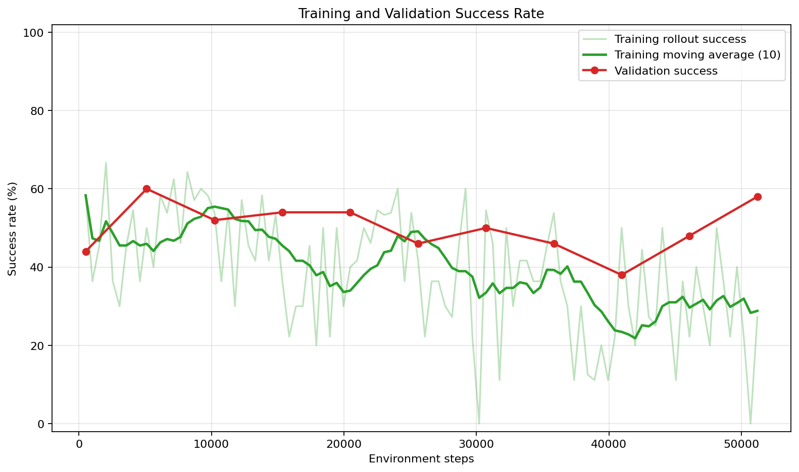
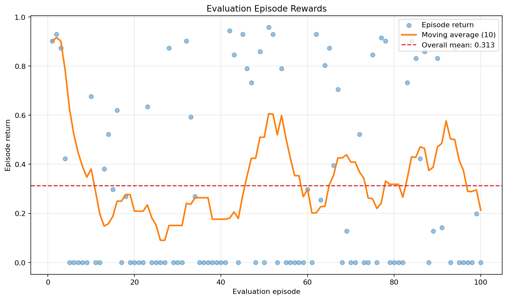
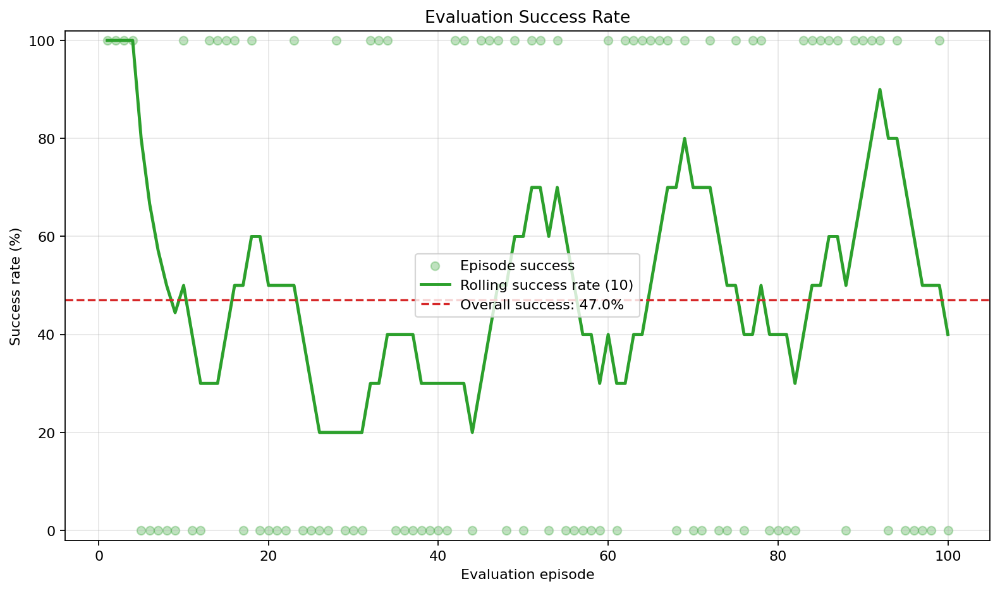
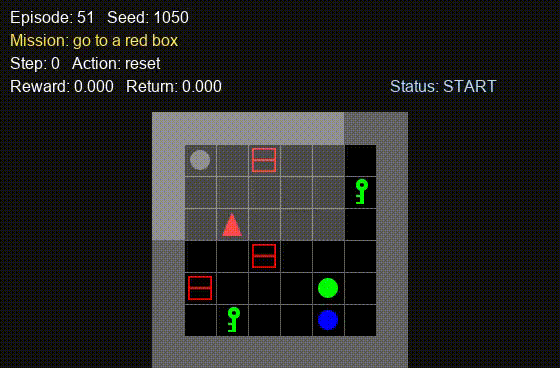
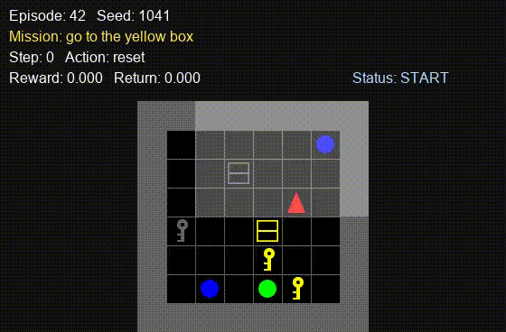
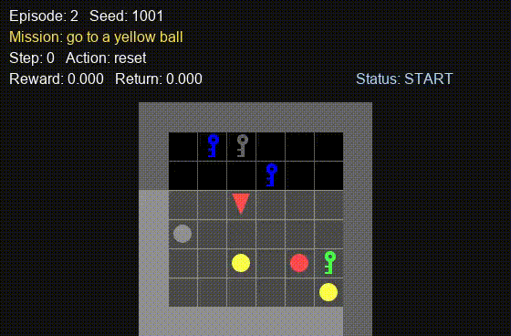

# Simplified Vision-Language Navigation with PPO

This project is a proof of concept for Vision-Language Navigation (VLN) in
`BabyAI-GoToLocal-v0`. The agent receives a partial RGB view of its surroundings,
a natural-language instruction such as `go to the red ball`, and its current
direction. It must navigate to the requested object using only three actions:

<p align="center">
  
</p>

<p align="center"><em>Example BabyAI-GoToLocal-v0 episode. This full-grid view helps readers follow the navigation task.</em></p>

| ID | Action | Meaning |
|---:|---|---|
| 0 | `left` | Rotate left |
| 1 | `right` | Rotate right |
| 2 | `forward` | Move one cell forward |

Restricting the policy to navigation actions removes irrelevant MiniGrid actions
such as pickup, drop, toggle, and done. Partial observability still makes the task
challenging: the target or an obstacle may be outside the agent's current field
of view, so an action must be chosen from incomplete visual information.

## Actor-Critic model

The model works in three simple stages. Read the diagram from left to right:



In plain language, the model first understands what it sees, what the mission
asks for, and which way it is facing. It combines these three pieces of
information once, then sends the shared result to two different output heads.

| Information | Encoder | Encoded size |
|---|---|---:|
| Partial RGB image | CNN | 128 |
| Mission text | Word embedding + GRU | 128 |
| Agent direction | Learned embedding | 16 |
| Combined information | Linear layer + ReLU | 256 |

The final 256-dimensional representation is shared by the actor and critic. The
actor outputs three action logits, while the critic outputs one value estimate.

The actor answers, “Which navigation action should be taken?” It produces three
logits that define a categorical policy $\pi_\theta(a_t\mid s_t)$. During normal
training and evaluation, actions are sampled from this distribution.

The critic answers, “How much discounted reward is expected from this state?” It
estimates $V_\theta(s_t)$. The actor and critic are trained together, allowing the
visual encoder, language encoder, direction embedding, and fusion layer to learn
a shared VLN representation.

## PPO algorithm

Proximal Policy Optimization (PPO) alternates between collecting experience and
updating the Actor-Critic network:

1. Collect an on-policy rollout using the current stochastic policy.
2. Estimate advantages and return targets with Generalized Advantage Estimation
   (GAE), using $\gamma=0.99$ and $\lambda=0.95$.
3. Normalize the advantages.
4. Shuffle the rollout and optimize the model for eight PPO epochs.
5. Discard that rollout and collect fresh on-policy experience.
6. Evaluate fixed validation seeds periodically and save the best checkpoint.

The best checkpoint is selected primarily by validation success rate. Higher
mean return and shorter mean episode length are used as tie-breakers.

### Amount of data per epoch

The completed experiment used the following data schedule:

| Quantity | Value |
|---|---:|
| Environment transitions per rollout/PPO update | 512 |
| Minibatch size | 64 |
| Minibatches per PPO epoch | 8 |
| PPO epochs per update | 8 |
| Optimizer steps per update | 64 |
| Number of PPO updates | 100 |
| Unique environment transitions | 51,200 |
| Total transition presentations during optimization | 409,600 |

Here, a **PPO epoch** means one pass over the same 512-transition rollout. Each
transition is therefore reused eight times before that rollout is discarded. The
409,600 figure counts this reuse; only 51,200 unique environment interactions
were collected.

## Loss function

For an action collected by the old policy, PPO first computes the probability
ratio

$$
r_t(\theta)=\frac{\pi_\theta(a_t\mid s_t)}
{\pi_{\theta_{\mathrm{old}}}(a_t\mid s_t)}
=\exp\left(\log\pi_\theta(a_t\mid s_t)
-\log\pi_{\theta_{\mathrm{old}}}(a_t\mid s_t)\right).
$$

With normalized advantage $\hat A_t$ and clipping coefficient
$\epsilon=0.2$, the minimized policy loss is

$$
L_{\mathrm{policy}}
=-\mathbb{E}_t\left[
\min\left(
r_t(\theta)\hat A_t,
\mathrm{clip}(r_t(\theta),1-\epsilon,1+\epsilon)\hat A_t
\right)
\right].
$$

Clipping prevents a single update from changing the policy probability ratio
too far away from 1. This generally makes policy updates more stable.

The critic is trained against the GAE-based return target $\hat R_t$:

$$
L_{\mathrm{value}}
=\frac{1}{2}\mathbb{E}_t\left[
\left(V_\theta(s_t)-\hat R_t\right)^2
\right].
$$

The entropy of the categorical action distribution is

$$
H(\pi_\theta)
=\mathbb{E}_t\left[-\sum_a
\pi_\theta(a\mid s_t)\log\pi_\theta(a\mid s_t)
\right].
$$

The implemented total loss is

$$
\boxed{
L_{\mathrm{total}}
=L_{\mathrm{policy}}
+0.5L_{\mathrm{value}}
-0.01H(\pi_\theta)
}
$$

The policy and value terms are minimized. Entropy is subtracted so that higher
entropy is rewarded, encouraging exploration instead of making the policy
deterministic too early. Gradients are clipped to a maximum norm of 0.5 before
each Adam optimizer step. The learning rate is $2.5\times10^{-4}$.

## Training results

The following results come from the saved run in
`runs/ppo_gotolocal_validation` with seed 42.

| Measurement | Update 1 | Update 100 |
|---|---:|---:|
| Environment steps | 512 | 51,200 |
| Mean completed-episode rollout return | 0.3970 | 0.2344 |
| Rollout success rate | 58.33% | 27.27% |
| Policy loss | -0.01701 | -0.02234 |
| Value loss | 0.01151 | 0.00159 |
| Entropy | 1.08817 | 0.58224 |
| Total loss | -0.02214 | -0.02736 |







Actor and total losses are optimization objectives, not direct measures of task
performance, so they are not expected to decrease monotonically. Rollout reward
and success are also noisy because different missions are completed during each
rollout. Fixed-seed validation is therefore used for checkpoint comparison.

The best validation result occurred at update 10 (5,120 environment steps):

| Validation metric | Result |
|---|---:|
| Episodes | 50 |
| Mean return | 0.3905 |
| Mean episode length | 40.50 |
| Success rate | 60.00% |

Although update 100 reached a higher validation mean return of 0.4464, its
success rate was 58%. Update 10 remains the best checkpoint because validation
success rate is the primary selection criterion.

## Evaluation results

`checkpoint_best.pt` was evaluated stochastically on 100 episodes with seeds
1000–1099, which are separate from the validation seeds.

| Evaluation metric | Result |
|---|---:|
| Checkpoint update | 10 |
| Checkpoint environment steps | 5,120 |
| Episodes | 100 |
| Mean return | 0.3135 |
| Mean episode length | 45.05 |
| Success rate | 47.00% |





The difference between the 60% validation success rate and 47% evaluation
success rate is possible because the policy is stochastic and the two sets use
different environment seeds. More training seeds and repeated evaluations would
be needed for a stronger estimate of generalization performance.

## Best Result Cases

Evaluation records every episode temporarily and keeps the three episodes with
the highest return. Each frame displays the mission, selected action, immediate
reward, cumulative return, and episode status. The animated previews below play
automatically and loop inside the README.

### Demo 1 — episode 51, return 0.958, seed 1050



[Open the original MP4](runs/ppo_gotolocal_3actions/videos/rank_01_episode_051_return_0.958_seed_1050.mp4)

### Demo 2 — episode 42, return 0.944, seed 1041



[Open the original MP4](runs/ppo_gotolocal_3actions/videos/rank_02_episode_042_return_0.944_seed_1041.mp4)

### Demo 3 — episode 2, return 0.930, seed 1001



[Open the original MP4](runs/ppo_gotolocal_3actions/videos/rank_03_episode_002_return_0.930_seed_1001.mp4)

To reproduce an evaluation and save its three best episodes:

```powershell
python evaluate.py `
  --checkpoint runs/ppo_gotolocal_validation/checkpoint_best.pt `
  --episodes 100 `
  --output runs/ppo_gotolocal_validation/evaluation_results.json `
  --video-dir runs/ppo_gotolocal_validation/videos `
  --video-episodes 3
```

<!-- > **Publishing note:** the diagrams are stored in `images/plots`, and the
> animated GIF previews are stored in `docs/demos`, so both can be committed and
> displayed in a remote repository. The original MP4 files remain under the
> Git-ignored `runs/` directory and are available only in the current workspace
> unless published separately. -->

## Installation and usage

Install the dependencies:

```powershell
python -m pip install -r requirements.txt
```

Train the model:

```powershell
python train.py `
  --num-updates 100 `
  --rollout-steps 512 `
  --validation-episodes 50 `
  --validation-interval 10 `
  --output-dir runs/ppo_gotolocal_validation
```

Evaluate the model (Stochastic sampling):
```powershell
python evaluate.py `
  --checkpoint runs/ppo_gotolocal_validation/checkpoint_best.pt `
  --episodes 100 `
  --output runs/ppo_gotolocal_validation/evaluation_results.json `
  --video-dir runs/ppo_gotolocal_3actions/videos `
  --video-episodes 3
```

Generate the result diagrams:

```powershell
python -m scripts.plot_results `
  --training-csv runs/ppo_gotolocal_validation/training_metrics.csv `
  --evaluation-json runs/ppo_gotolocal_validation/evaluation_results.json `
  --output-dir runs/ppo_gotolocal_validation/plots `
  --smooth-window 10
```

See [running.md](running.md) for additional evaluation commands.
